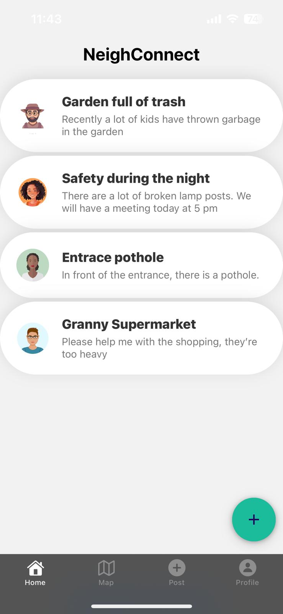
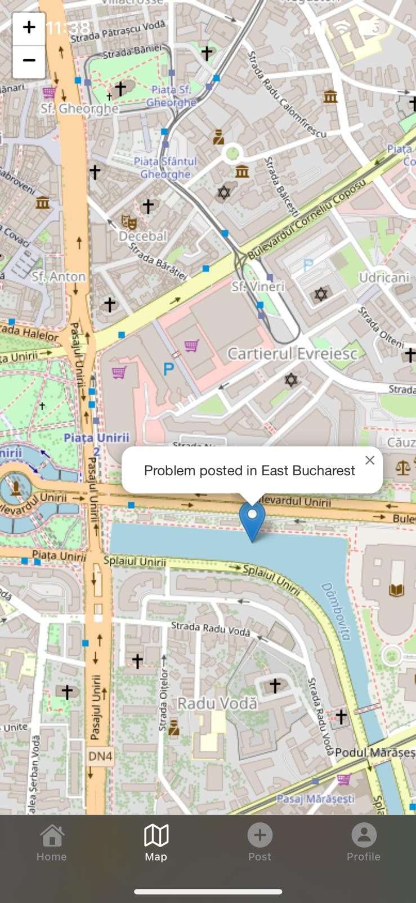

## **NeighConnect**

*A community-driven app to report, solve, and connect over neighborhood issues!*

### **Overview**  
NeighConnect is a **React Native** mobile app that allows users to **report neighborhood problems**, **help solve others' issues**, and **connect with their community**. Users can post **photos, videos**, and **descriptions** of issues and view them **on an integrated Google Map**. The app is powered by a **Strapi backend** and runs using **Expo Go**.

---

## **Features**
✅ **Post Issues:** Report neighborhood problems with **photos, videos, and descriptions**  
✅ **Solve Problems:** Other users can help by responding to issues  
✅ **Interactive Map:** View problem locations using **Google Maps integration**  
✅ **Customizable Profile:** Users can set up and personalize their profile  
✅ **Community Engagement:** Comment, discuss, and collaborate on issues  
✅ **Expo Go Support:** Easily run and test the app using Expo  

---

## **📲 Screenshots**

### **Home Screen**
Users can see all reported problems from the community.  
<p align="center">
  
</p>

### **Map Integration**
Reported issues are pinned on the map with details.  

<p align="center">
  
</p>

---

## **🛠️ Tech Stack**
- **Frontend:** React Native (Expo)
- **Backend:** Strapi (Node.js)
- **Maps:** Google Maps API (for interactive issue visualization)
- **Storage:** Strapi Media Library (for photos & videos)

---

## **📥 Installation & Setup**

### **Prerequisites**
- Install **Node.js** (v16 or later)
- Install **Expo CLI**  
  ```sh
  npm install -g expo-cli
  ```
- Install **Yarn** (optional but recommended)
  ```sh
  npm install -g yarn
  ```

### **1️⃣ Clone the Repository**
```sh
git clone https://github.com/your-username/neigh-connect.git
cd neigh-connect
```

### **2️⃣ Install Dependencies**
```sh
yarn install
# or
npm install
```

### **3️⃣ Start the App**
```sh
expo start
```
🚀 Open the app in **Expo Go** on your phone or in an emulator.

---

## **🌍 Backend Setup (Strapi)**
To run the **Strapi backend**, navigate to the `backend` folder:

```sh
cd backend
yarn install  # or npm install
yarn develop  # or npm run develop
```
This starts the backend, making APIs available for authentication, posting issues, and managing user profiles.

---

## **🗺️ Google Maps Integration**
To enable **Google Maps API**, follow these steps:

1. Go to the **[Google Cloud Console](https://console.cloud.google.com/)**.
2. Enable **Maps SDK for Android** and **Maps SDK for iOS**.
3. Generate an **API key**.
4. In your project, add the API key to `app.json`:
   ```json
   "expo": {
     "android": {
       "config": {
         "googleMaps": {
           "apiKey": "YOUR_API_KEY"
         }
       }
     }
   }
   ```

---

### 🏆 Hackathon Project  

This project was developed during the **Deutsche Bank Hackathon** by:  
- **Robert** ([GitHub](https://github.com/robertpaulp))  
- **Victor** ([GitHub](https://github.com/Viktor09))  
- **Rares** ([GitHub](https://github.com/rrsmart8))  


